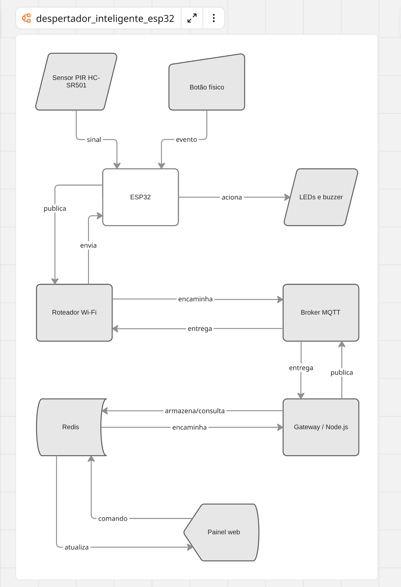

# Despertador Inteligente com Sensor de Movimento

Projeto desenvolvido na disciplina de Tópicos Especiais em Robótica utilizando o microcontrolador ESP32.

O sistema consiste em um despertador inteligente programado para verificar a presença do usuário antes do horário definido. Caso nenhum movimento seja detectado pelo sensor PIR dentro da janela de monitoramento, o ESP32 aciona um alarme sonoro e um indicador luminoso.

## Objetivo

Desenvolver um sistema IoT capaz de:

* monitorar a presença do usuário;
* verificar o horário programado;
* ativar um alarme quando nenhum movimento for detectado;
* permitir o controle local e remoto do alarme;
* transmitir dados por MQTT;
* armazenar estados e eventos;
* disponibilizar informações em uma interface web.

## Funcionamento inicial

O funcionamento planejado será:

1. O ESP32 sincroniza o horário por meio da rede Wi-Fi.
2. Antes do horário configurado, o sensor PIR monitora o ambiente.
3. Caso seja detectado movimento, o sistema registra que o usuário acordou.
4. No horário definido, se nenhum movimento tiver sido detectado, o alarme é ativado.
5. O buzzer emite o alerta sonoro.
6. O LED vermelho indica que o alarme está ativo.
7. O botão físico permite desligar o alarme.
8. O LED verde indica que o sistema detectou movimento.

## Regra principal

> No horário definido, se nenhum movimento tiver sido detectado durante a janela de monitoramento, o ESP32 deverá acionar o buzzer e o LED vermelho.

Inicialmente, o horário será fixado no código. Posteriormente, ele poderá ser configurado pelo painel web.

## Arquitetura inicial

O diagrama abaixo apresenta a arquitetura inicial do sistema, incluindo os componentes físicos, a comunicação Wi-Fi, o broker MQTT, o gateway Node.js, o banco de dados Redis e o painel web.



## Componentes

* 1 protoboard;
* 1 buzzer;
* 2 LEDs;
* jumpers;
* 1 sensor PIR HC-SR501.
* 1 ESP32 DevKit V1;
* 1 cabo USB compatível com o ESP32;
* 1 botão pulsador;
* 2 resistores de 220 Ω ou 330 Ω;
* 1 fonte USB de 5 V.

## Tecnologias planejadas

### Hardware

* ESP32;
* sensor PIR HC-SR501;
* buzzer;
* LEDs;
* botão pulsador;
* protoboard.

### Software e infraestrutura

* Arduino IDE ou PlatformIO;
* JavaScript ou Python para programação do ESP32;
* Wi-Fi;
* NTP para sincronização de horário;
* MQTT;
* Node.js;
* Redis;
* API REST;
* HTML, CSS e JavaScript.

## Fluxo de dados

O sensor PIR envia ao ESP32 o estado da detecção de movimento.

```text
Sensor PIR → ESP32
```

O ESP32 processa os dados e publica informações no broker MQTT.

```text
ESP32 → Wi-Fi → Broker MQTT
```

O gateway Node.js recebe as mensagens, valida os dados e registra os eventos no Redis.

```text
Broker MQTT → Node.js → Redis
```

O painel web consulta a API para exibir o estado atual e o histórico.

```text
Redis → API REST → Painel Web
```

Os comandos remotos percorrem o caminho inverso.

```text
Painel Web → API → Node.js → MQTT → ESP32
```

## Autor

**Gabrielle de Oliveira Fonseca**
**0072379**

Projeto acadêmico desenvolvido para a disciplina de Tópicos Especiais em Robótica.
